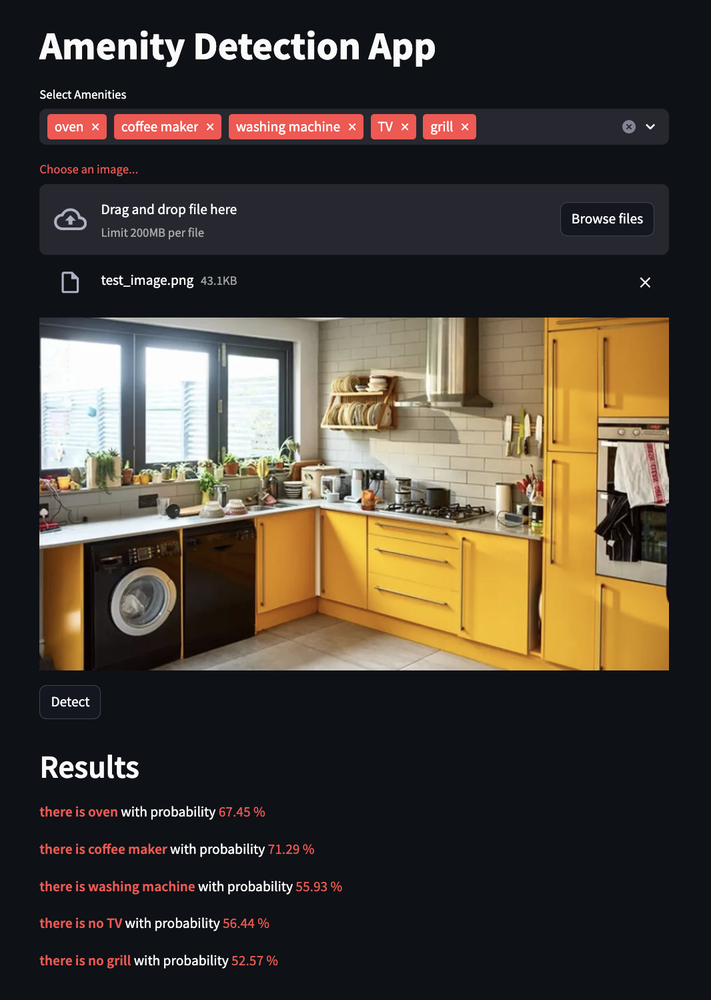

# Amenity Detection using Zero-Shot Classification with CLIP

Detection of amenities in property images using pre-trained CLIP and ALIGN models.

A simple image-text retrieval system experimenting with  pre-trained CLIP and ALIGN models. Given an image of a room and a set of complementary labels (e.g. "there is a microwave", "there is no microwave") the model predicts whethere there is an amenity in the image or not. This information can be useful to cross-check it with the property description and detect possible discrepancies.

There are many other approaches and models that can be used for this task (e.g. object detection using YOLO, etc.). The goal of this project is to experiment with multi-modal models CLIP and ALIGN and see how they perform in this task.

## Data
Using a sample of [Kaggle Room street dataset](https://www.kaggle.com/datasets/mikhailma/house-rooms-streets-image-dataset?resource=download) for testing the model. The dataset contains images of rooms and houses.

## App
The app is a simple streamlit app that allows the user to upload an image and verify a set of amenities to detect. The model will predict whether the amenities are present in the image or not.



## Installation
1. Clone the repository
2. Install the package
   ```bash
   pip install poetry
   poetry install
   ```
3. Run the app
    ```bash
    streamlit run src/app/app.py
    ```

## References
1. [CLIP: Contrastive Language–Image Pre-training](https://openai.com/index/clip/)
2. [Cameron R. Wolfe: Using CLIP to classify images without any labels](https://cameronrwolfe.substack.com/p/using-clip-to-classify-images-without-any-labels-b255bb7205de)
